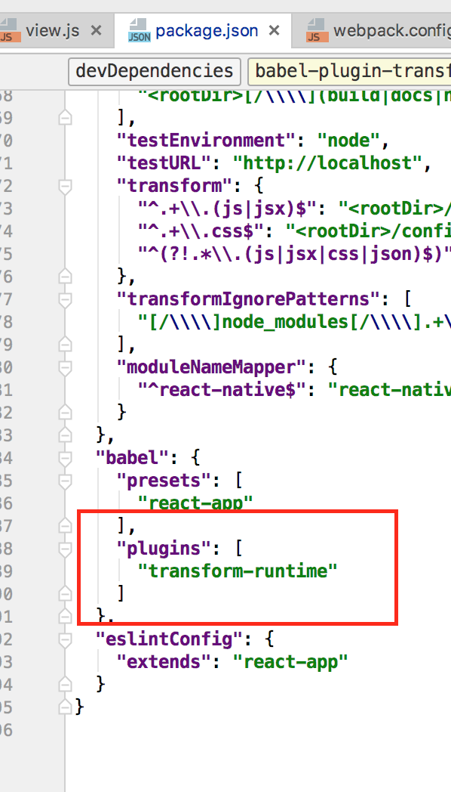

# Effect with Async/Await
Usually, we do async operations inside effect and as we all known, async 
operations could be very complex. However we have async/await keywords
to help us handle it. We recommend to use them in dongbao along with **Effect**

## config your project to use async/await keywords
* if you create your project from create-react-app
    * use ```npm install --save-dev babel-plugin-transform-runtime```
    * add the following config in your ```package.json``` file
    


* if you use .babelrc file to config your babel, just add the same config to it
 
 
 
## understand async/await keywords
[see here](https://ponyfoo.com/articles/understanding-javascript-async-await)


## use async/await with Effects
So now you can define **Effect** with async/await like :
```javascript
State({
  ...,
  effects:{
    async doSomethingAsync(){
      let result = await callWebApi()
      this.updateState(result)
    }
  }
})

```
here callWebApi should return a promise, if it resolve a value, it will be assign to result and continue, 
if it rejects, it will throw an exception inside ```doSomethingAsync```. By using async/await, we turn every async to sync-like.
