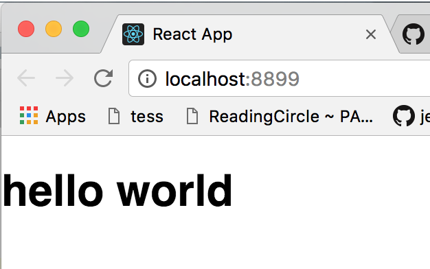

# Hello World!

Let's now build a Hello World sample

### Step 1: add import
Open your ```src/App.js``` file and add the following code in your import:

```javascript
// ...
import {State,connect} from 'dongbao'
// ...
```


### Step 2: add State
before your App component, add the following code:
```javascript
let state = State({
  initial:{
    text:"hello world"
  }
})

```
this will define the initial state of our react application as ```{text:"hello world"}```

### Step 3: connect App component
replace the following code: 
```javascript
export default App;
```
with
```javascript
export default connect({
  map(state){
    return {
      text:state.text
    }
  }
})(App);
```
this will map the state to your App component's props (this is very 
similar with react-redux's connect method, but more powerful,
see connect section for more details)


### Step 4: show 'text' on App
replace the origin App render() method
```javascript
class App extends Component {
  render() {
    return (
      <div className="App">
        <div className="App-header">
          
          <h2>Welcome to React</h2>
        </div>
        <p className="App-intro">
          To get started, edit <code>src/App.js</code> and save to reload.
        </p>
      </div>
    );
  }
}
```

with the following:
```javascript
class App extends Component {
  render() {
    return (
      <div>
        <h1>{this.props.text}</h1>
      </div>
    );
  }
}
```

this will show our "helloworld" text in the content of App component.
Now we finished the ```'src/App.js'``` file, the whole code should be the same as the following code:
```
// 'src/App.js'

import React, { Component } from 'react';
import logo from './logo.svg';
import './App.css';
import {State,connect} from 'dongbao'


let state = State({
  initial:{
    text:"hello world"
  }
})

class App extends Component {
  render() {
    return (
      <div>
        <h1>{this.props.text}</h1>
      </div>
    );
  }
}

export default connect({
  map(state){
    return {
      text:state.text
    }
  }
})(App);

```

Step 5: Render your App component
change the content of ```'src/index.js'``` file as:
```javascript
import React from 'react';
import ReactDOM from 'react-dom';
import App from './App';
import './index.css';
import {render} from 'dongbao'


render(App)
```
this will use render method from ```dongbao``` 

## Step 6: Start your App

now start your program by running:
```bash
npm start
```

you should see ```hello world``` on your browser



cong! you finish the hello world sample (see repo for this sample [here](...))
