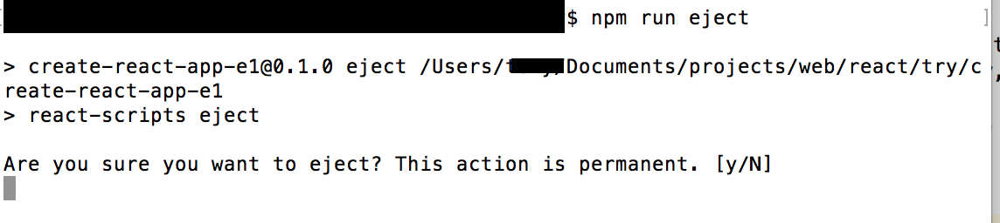
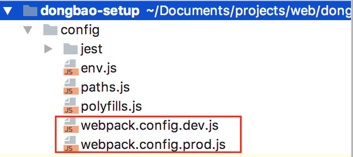
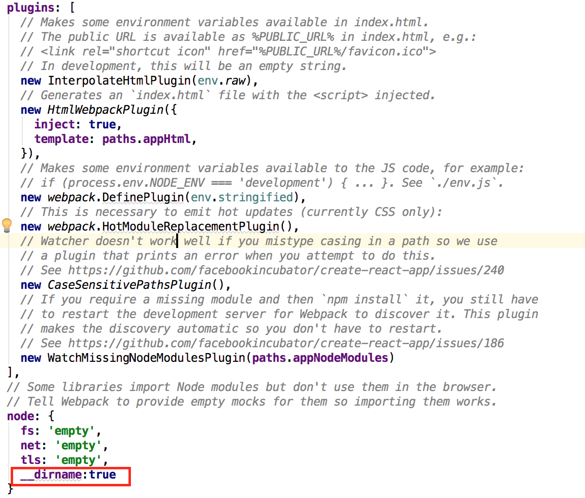

# Installation and Setup

### Step1: create project
```bash
create-react-app <your project name>
```
if you don't have create-react-app installed, use the following script
```bash
npm install -g create-react-app
```

### Step2: install dongbao
```bash
npm install --save dongbao
# or if you are a yarn user
yarn add dongbao
```

### Step3: steup environment
currently, we don't have a cli tool for dongbao (but will do in the future), so we need to eject the react build script and modify
some configuration. Don't worry, we only modify a liitle

first run the following scripts in your shell
```bash
npm run eject
```

a prompt appear like the following screenshot:



type 'y' and hit enter, this will takes sometime to eject the build script into your current project.
 
after the eject finished, open the following two files:


scroll down to the bottom and add the ```__dirname:true``` at the following position


now you finished all the configuration.


> tips: we config __dirname here because we need it to enable auto-bootstrap state and reducers