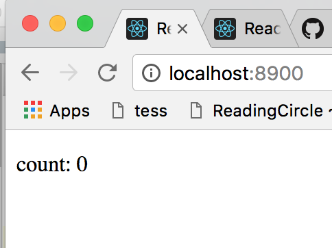

# Create State

One of the core concept of dongbao is State. State is used to
define:
* initial state: the initial state of you application
* actions: reducer methods which generate the next state for the given payload. (If you 
are not familiar with the concept of reducer, action and payload,
read the document of redux first)
* effects: actions which has side effect(like ajax request)
* plugins: will be covered in advanced tutorial


Let's see how we define them in Counter sample


## Step 1: Define the StateConfig

a StateConfig is nothing but a plain js object which has the 
following properties on it
```javascript
{
  path:"", // {string} optional: relative path for this state to root state
  initial:"", // {string} optional: initial state
  actions:{},  // {obj} optional: action definitions
  effects:{}   // {obj} optional: effect definitions
  plugins:[]   // {array} optional: plugin definitions
}
```
here we will only focus on ```initial```, ```actions```, ```effects```, the other 2 
property will be covered in advanced tutorial.


Let's add a StateConfig to our sample project. Go to ```"src/App.js"``` file, add the following code
before you App component

```javascript

let stateConfig = {
  initial: {
    count: 0
  },
  actions: {
    increase(state){
      return {
        count:state.count+1
      }
    },
    decrease(state){
      return {
        count:state.count-1
      }
    },
    increaseGivenNumber(state,number){
      return {
              count:state.count + number
      }
    }
    
  }
}
```
here we define the the initial state and 3 actions. The function we defined
 for action has the following signature:
```javascript
actionFn(state,payload,error,meta)
```
If you are familiar with [FSA](https://github.com/acdlite/flux-standard-action), it's easy to
 understand each parameters mean here. The actionFn is just a sub-reducer,
 and it accept the previous state and payload,error,meta from action 
 you are issue. A new state should be return from this function.
 
 > Tips: since this is a reducer function which will be internally used by redux, remember to return a new object for new state, otherwise, state might not changed. Also don't put async logic inside an action, use [effect]() for aysnc actions
 
 > also, we don't follow the reducerFn(state,action) which used by redux, because most action don't contain error and meta with them actually, spread the parameters help write less boilerplate code.
 
## Step 2 : Register the StateConfig
After we create the StateConfig object, we need to register it to 
let ```dongbao``` generate action, actionCreator, actionDispatcher 
for it. It's just a simple call of ```State(stateConfig)``` method
 
```javascript

// in src/App.js

// ...
// don't forget to import Stat
import {State} from 'dongbao'
// ...

let stateConfig = {...}

let state = State(stateConfig)

```

The ```State(...)``` method will return an object which has **ActionDispacther**
 defined on it, you can call them to trigger create specific action and dispatch them:
 
```javascript
// e.g. when you call 
state.increse()

// it will call the following
dispatch({
  type:"increase",
  payload:undefined,
  error:undefined,
  meta:undefined
})

// when you call
state.increaseGivenNumber(number)

// it will call the following
dispatch({
  type:"increaseGivenNumber",
  payload:number,
  error:undefined,
  meta:undefined
})

// in general 
// an actionFn(state,payload,error,meta) 
// will generate an actionDispatcher(payload,error,meta)
// which dispatch a "actionFn" type action

```
> Tips: you can export the return value of State(stateConfig), so that other module's can use the actionDispatcher on it, 
it works just like a 'service'


We have finished our state definition now, let's try to build Counter's UI


## Step 3: bind state to component props
In react-redux, we can use ```connect(...)``` function to bind state to component's props.
We can do the same thing in dongbao like:
```javascript

// ...
import {State, connect} from 'dongbao' // import connect
// ...

// here the map function accept the state and return an obj
// which will be set as the props on App component
export default connect({
  map: function (state) { 
    return {             
      count:state.count
    }
  }
})(App);

```
As you see the connect(...) from dongbao is similar to the one from react-redux,
However, dongbao's connect(...) is more powerful, you can see it in [Advanced Tutorial]

Let's update ```App's render()```  method to see our effect of binding

```javascript
class App extends Component {
  render() {
    return (
      <div >
        <p>count: {this.props.count}</p>
      </div>
    );
  }
}
```
run the application with ```npm start```
you should see that the count value is update on the UI



## Step 4: Build the UI
now let's add the increase and decrease buttons on the UI

```javascript

class App extends Component {
  render() {
    return (
      <div >
        <p>count: {this.props.count}</p>
        <div>
          <button onClick={()=>state.increase()}>+</button>
          <button onClick={()=>state.decrease()}>-</button>
        </div>
      </div>
    );
  }
}
```
as you can see we directly call the **ActionDispatcher** methods
on **state** obj. Turn to your project, it should works now!

Now, we already build a workable counter! In the next section,
we will introduce the **effect**

## Step 5: Add Effects
The concept of **Effect** is simple, let's first see a quick example

```javascript
// src/App.js

// ... for stateConfig, add effects
let stateConfig = {
  initial: {
    ...
  },
  actions: {
    ...
  },
  effects:{
    increaseAfterOneSecond(){
     setTimeout(()=>{
       this.increase()
     },1000) 
    }
  }
}

// ... for App component, add a new button to call the effect we add

class App extends Component {
  render() {
    return (
      <div >
        <p>count: {this.props.count}</p>
        <div>
          <button onClick={()=>state.increase()}>+</button>
          <button onClick={()=>state.decrease()}>-</button>
          // [new buttons goes here]
          <button onClick={()=>state.increaseAfterOneSecond()}>+ after 1s</button>
        </div>
      </div>
    );
  }
}
```
Go back to your browser and test the button you just add, it should works

**Here we have several things to explain:**
 
* like action, we define effect with a **name** and a **effectFn(payload,getState,error,meta)**, the ```State(stateConfig)```
method will turn **effectFn** into a callable function **effectExecFn(payload,error,meta)** which you can access from the ```state``` object 
returned from ```State(...)``` method use the **name**

* inside the **effectFn(...)** **'this'** will bind to a object has all **ActionDispatcher** and **effectExecFn** on them, 
this means you can compose other effects and actions inside your effects

* when you call **effectExecFn(...)** there is no action create for it and pass to redux's reducer. So you can't directly
get the current state, we pass ```getState()``` for you in **effectFn(...)**

* if you return a ```Promise``` from **effectFn**, it will be 
return from **effectExecFn** when you call it. If your *effectFn* returns
nothing, the **effectExecFn** also returns a ```Promise``` which is (```Promise.resolve(undefined)```),
so **effectExecFn** always returns a promise. This might be useful when you 
compose effects together. (We will discuss this in Advanced Tutorial along with async/await keywords)


## Conclusion
Great, now you finished your **Counter Tutorial** for dongbao. Next step, we 
need to introduce some advanced features of dongbao to help you build real world applications easily.
Let's move to next section!